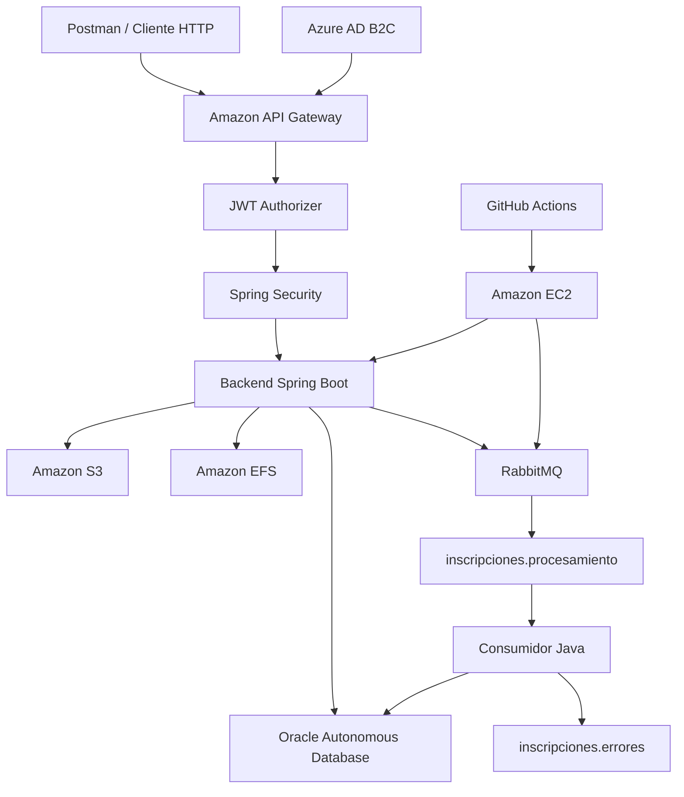

# Plataforma Cloud Native de Gestión de Cursos e Inscripciones

Proyecto Cloud Native desarrollado con Java y Spring Boot para gestionar cursos en línea, registrar inscripciones de estudiantes, generar documentos PDF, almacenar archivos en servicios Cloud y procesar información de manera asíncrona mediante RabbitMQ.

La solución incorpora autenticación y autorización mediante Azure AD B2C, protección de endpoints con Spring Security y Amazon API Gateway, persistencia en Oracle Autonomous Database, almacenamiento en Amazon S3 y Amazon EFS, ejecución contenerizada en Amazon EC2 y despliegue automatizado mediante GitHub Actions.

## Integrantes

- **Francisco Villarzú Miraglia**
- **Miguel Zananiri Valenzuela**

## Información académica

- **Asignatura:** Desarrollo Cloud Native — CDY2204
- **Evaluación:** Evaluación Final Transversal
- **Institución:** Duoc UC
- **Semana:** 9

---

## Objetivo del proyecto

Implementar una solución backend Cloud Native que permita:

- Consultar la oferta de cursos disponibles.
- Buscar cursos por nombre.
- Crear, actualizar y eliminar cursos.
- Registrar estudiantes e inscripciones.
- Inscribir a un estudiante en uno o más cursos.
- Calcular el valor total de una inscripción.
- Generar documentos PDF con el resumen de inscripción.
- Almacenar documentos en Amazon S3.
- Mantener los archivos generados en Amazon EFS.
- Publicar mensajes en RabbitMQ.
- Consumir y persistir los mensajes procesados.
- Derivar mensajes inválidos hacia una cola de errores.
- Orquestar la mensajería mediante un componente BFF.
- Proteger los endpoints mediante tokens JWT y roles.
- Publicar la API mediante Amazon API Gateway.
- Automatizar las pruebas y el despliegue en Amazon EC2.

---

## Arquitectura



### Flujo principal

```text
Cliente HTTP
→ Amazon API Gateway
→ Validación del token JWT
→ Spring Security
→ Backend Spring Boot
→ Oracle Autonomous Database
→ Generación del resumen PDF
→ Amazon EFS
→ Amazon S3
→ Publicación en RabbitMQ
→ Consumo mediante el BFF
→ Persistencia del resultado procesado
```

### Componentes desplegados

El ambiente Cloud utiliza:

```text
Amazon EC2
├── Contenedor eft-backend
└── Contenedor eft-rabbitmq
```

El backend se comunica con RabbitMQ mediante una red privada de Docker. El puerto AMQP no necesita exponerse públicamente.

---

## Tecnologías utilizadas

| Tecnología | Aplicación en el proyecto |
|---|---|
| Java 17 | Lenguaje principal |
| Spring Boot 3.5 | Desarrollo del backend |
| Spring MVC | Implementación de endpoints REST |
| Spring Security | Autenticación y autorización basada en JWT |
| Spring Data JPA | Persistencia y acceso a datos |
| Spring AMQP | Integración con RabbitMQ |
| Jakarta Validation | Validación de solicitudes |
| RabbitMQ | Procesamiento asíncrono de mensajes |
| Oracle Autonomous Database | Persistencia del ambiente Cloud |
| H2 | Persistencia temporal para pruebas locales |
| OpenPDF | Generación de documentos PDF |
| Amazon S3 | Almacenamiento Cloud de documentos |
| Amazon EFS | Persistencia compartida de archivos generados |
| Amazon EC2 | Ejecución de los contenedores |
| Amazon API Gateway | Publicación y gestión centralizada de endpoints |
| Azure AD B2C | Identity as a Service y emisión de tokens |
| Docker | Contenerización de la aplicación |
| Docker Compose | Orquestación de los contenedores |
| GitHub Actions | Integración, pruebas y despliegue continuo |
| Postman | Pruebas funcionales y de seguridad |

---

## Funcionalidades principales

### Gestión de cursos

El backend permite:

- Listar todos los cursos.
- Consultar un curso mediante su identificador.
- Buscar cursos por coincidencia parcial del nombre.
- Crear nuevos cursos.
- Actualizar cursos existentes.
- Eliminar cursos.
- Impedir el registro de nombres duplicados.
- Validar nombre, instructor, duración y costo.

Las operaciones de creación, modificación y eliminación están reservadas para usuarios con rol `INSTRUCTOR`.

### Gestión de inscripciones

El sistema permite:

- Registrar los datos de un estudiante.
- Seleccionar uno o más cursos.
- Evitar identificadores nulos o duplicados.
- Validar que los cursos seleccionados existan.
- Calcular el total de la inscripción.
- Guardar la inscripción y sus detalles.
- Publicar automáticamente un mensaje en RabbitMQ.

### Generación de documentos PDF

Cada inscripción puede generar un documento PDF que contiene:

- Número de inscripción.
- Fecha de inscripción.
- Nombre del estudiante.
- Correo electrónico.
- Cursos seleccionados.
- Instructor de cada curso.
- Duración.
- Costo individual.
- Total a pagar.

Los archivos utilizan el siguiente nombre:

```text
resumen-inscripcion-{idInscripcion}.pdf
```

---

## Almacenamiento Cloud

### Amazon S3

Los documentos se almacenan en una estructura jerárquica basada en el identificador de la inscripción:

```text
{idInscripcion}/
└── resumen-inscripcion-{idInscripcion}.pdf
```

Ejemplo:

```text
3/
└── resumen-inscripcion-3.pdf
```

El backend permite:

- Subir el resumen a S3.
- Reemplazar el documento.
- Descargarlo como `application/pdf`.
- Eliminarlo.
- Validar la existencia del objeto.
- Mantener bloqueado el acceso público al bucket.

### Amazon EFS

Amazon EFS se utiliza como almacenamiento persistente para los PDF generados por el backend.

Ruta utilizada en Amazon EC2:

```text
/mnt/eft-efs/resumenes
```

Ruta utilizada dentro del contenedor:

```text
/app/resumenes
```

La asociación se realiza mediante un volumen de Docker Compose:

```yaml
volumes:
  - /mnt/eft-efs/resumenes:/app/resumenes
```

Esto permite conservar los documentos aunque el contenedor del backend sea reconstruido o reemplazado.

---

## Procesamiento asíncrono con RabbitMQ

La solución implementa dos colas principales:

| Cola | Responsabilidad |
|---|---|
| `inscripciones.procesamiento` | Almacenar inscripciones pendientes de procesamiento |
| `inscripciones.errores` | Conservar mensajes que no pudieron procesarse |

### Flujo correcto

```text
Creación de inscripción
→ Productor Java
→ inscripciones.procesamiento
→ BFF de consumo
→ Consumidor Java
→ Validación del mensaje
→ Persistencia en la tabla RESUMEN
```

### Flujo de error

```text
Mensaje inválido
→ Consumidor Java
→ Error de validación o procesamiento
→ inscripciones.errores
```

### Componente BFF

El backend incluye un BFF encargado de orquestar las operaciones de mensajería.

El BFF expone dos endpoints:

```text
POST /api/bff/colas/inscripciones/producir
POST /api/bff/colas/inscripciones/consumir
```

El primer endpoint publica un mensaje en la cola principal.

El segundo endpoint recupera un mensaje, lo procesa y almacena el resultado en Oracle. Cuando el mensaje es inválido, se deriva hacia la cola de errores.

---

## Seguridad

La solución aplica seguridad en dos niveles.

### Azure AD B2C

Azure AD B2C se utiliza para:

- Registrar usuarios.
- Autenticar mediante un flujo de inicio de sesión.
- Emitir tokens JWT.
- Incorporar un atributo personalizado de rol.
- Diferenciar estudiantes e instructores.

Claim utilizado por la aplicación:

```text
extension_consultaRole
```

### Amazon API Gateway

Amazon API Gateway:

- Expone un punto de acceso centralizado.
- Registra las rutas del backend.
- Utiliza un JWT Authorizer.
- Valida el emisor del token.
- Valida la audiencia.
- Rechaza solicitudes sin autenticación.
- Redirige las solicitudes autorizadas hacia Amazon EC2.

La API utiliza una integración proxy:

```text
ANY /{proxy+}
```

### Spring Security

Spring Security:

- Configura el backend como OAuth2 Resource Server.
- Valida la firma del token.
- Verifica el emisor.
- Comprueba la vigencia.
- Valida la audiencia.
- Convierte el claim personalizado en roles.
- Restringe cada endpoint.
- Mantiene una arquitectura sin sesiones.
- Bloquea todas las rutas que no hayan sido declaradas.

### Roles

| Rol | Permisos principales |
|---|---|
| `ESTUDIANTE` | Consultar cursos, registrar inscripciones y descargar resúmenes |
| `INSTRUCTOR` | Consultar y administrar cursos, gestionar documentos y operar el BFF |

### Respuestas esperadas

| Situación | Resultado |
|---|---|
| Token válido y rol autorizado | `200 OK`, `201 Created`, `202 Accepted` o `204 No Content` |
| Token válido sin permisos suficientes | `403 Forbidden` |
| Solicitud sin token o token inválido | `401 Unauthorized` |

---

## Endpoints REST

Los endpoints se consumen mediante Amazon API Gateway.

### Cursos

| Método | Endpoint | Rol requerido | Descripción |
|---|---|---|---|
| `GET` | `/api/cursos` | `ESTUDIANTE` o `INSTRUCTOR` | Listar los cursos |
| `GET` | `/api/cursos/{id}` | `ESTUDIANTE` o `INSTRUCTOR` | Consultar un curso por ID |
| `GET` | `/api/cursos/buscar?nombre={texto}` | `ESTUDIANTE` o `INSTRUCTOR` | Buscar cursos por nombre |
| `POST` | `/api/cursos` | `INSTRUCTOR` | Crear un curso |
| `PUT` | `/api/cursos/{id}` | `INSTRUCTOR` | Actualizar un curso |
| `DELETE` | `/api/cursos/{id}` | `INSTRUCTOR` | Eliminar un curso |

### Inscripciones

| Método | Endpoint | Rol requerido | Descripción |
|---|---|---|---|
| `POST` | `/api/inscripciones` | `ESTUDIANTE` | Crear una inscripción |

### Resúmenes y almacenamiento

| Método | Endpoint | Rol requerido | Descripción |
|---|---|---|---|
| `GET` | `/api/inscripciones/{id}/resumen/archivo` | `ESTUDIANTE` o `INSTRUCTOR` | Generar y descargar el PDF persistido en EFS |
| `POST` | `/api/inscripciones/{id}/resumen/s3` | `INSTRUCTOR` | Generar y subir el PDF a S3 |
| `PUT` | `/api/inscripciones/{id}/resumen/s3` | `INSTRUCTOR` | Reemplazar el PDF en S3 |
| `GET` | `/api/inscripciones/{id}/resumen/s3` | `ESTUDIANTE` o `INSTRUCTOR` | Descargar el PDF desde S3 |
| `DELETE` | `/api/inscripciones/{id}/resumen/s3` | `INSTRUCTOR` | Eliminar el PDF de S3 |

### BFF y RabbitMQ

| Método | Endpoint | Rol requerido | Descripción |
|---|---|---|---|
| `POST` | `/api/bff/colas/inscripciones/producir` | `INSTRUCTOR` | Publicar un mensaje en RabbitMQ |
| `POST` | `/api/bff/colas/inscripciones/consumir` | `INSTRUCTOR` | Consumir y procesar un mensaje |

---

## Ejemplo de curso

### Solicitud

```json
{
  "nombre": "Arquitectura Cloud",
  "instructor": "Ana Martínez",
  "duracionHoras": 40,
  "costo": 85000
}
```

### Respuesta esperada

```json
{
  "id": 1,
  "nombre": "Arquitectura Cloud",
  "instructor": "Ana Martínez",
  "duracionHoras": 40,
  "costo": 85000
}
```

---

## Persistencia

### Ambiente local

El perfil local utiliza una base de datos H2 en memoria.

Este perfil facilita:

- Compilación del proyecto.
- Pruebas automatizadas.
- Validación del contexto de Spring.
- Desarrollo sin modificar los datos del ambiente Cloud.

### Ambiente Cloud

El ambiente desplegado utiliza Oracle Autonomous Database.

Las tablas principales son:

```text
CURSOS
ESTUDIANTES
INSCRIPCIONES
DETALLE_INSCRIPCIONES
RESUMEN
```

La tabla `RESUMEN` almacena los datos procesados desde RabbitMQ, permitiendo mantener trazabilidad entre:

- La inscripción original.
- El mensaje publicado.
- El consumo de la cola.
- El estudiante.
- El correo.
- La fecha de inscripción.
- El valor total procesado.

### Scripts Oracle

Los scripts de base de datos se encuentran en:

```text
database/oracle/
├── 01_schema.sql
├── 02_data.sql
└── README.md
```

`01_schema.sql` contiene la estructura de tablas, secuencias y relaciones.

`02_data.sql` contiene registros iniciales para validar el sistema.

---

## Contenedores

La solución utiliza Docker Compose para desplegar dos servicios:

```text
eft-backend
eft-rabbitmq
```

Los servicios comparten una red privada:

```text
eft-network
```

El contenedor del backend:

- Ejecuta la aplicación Spring Boot.
- Recibe las variables desde un archivo externo.
- Monta el Oracle Wallet en modo solo lectura.
- Monta el directorio de Amazon EFS.
- Espera que RabbitMQ se encuentre saludable.

RabbitMQ utiliza:

- Una imagen oficial con interfaz de administración.
- Un volumen persistente para conservar las colas.
- Un `healthcheck` antes de iniciar el backend.

---

## Integración y despliegue continuo

El workflow de GitHub Actions se ejecuta al enviar cambios a la rama:

```text
main
```

### Etapas del pipeline

```text
Checkout del repositorio
→ Configuración de credenciales temporales de AWS
→ Configuración de Java 17
→ Ejecución de pruebas Maven
→ Obtención de la IP pública del runner
→ Autorización SSH temporal en el Security Group
→ Conexión segura con Amazon EC2
→ Actualización del repositorio en EC2
→ Construcción de la imagen del backend
→ Despliegue mediante Docker Compose
→ Verificación del backend
→ Verificación de RabbitMQ
→ Revocación del acceso SSH temporal
```

La imagen Docker se construye directamente en Amazon EC2. El proyecto no depende de Docker Hub para realizar el despliegue.

### Configuración sensible

GitHub Secrets administra los valores requeridos por el workflow:

```text
AWS_ACCESS_KEY_ID
AWS_SECRET_ACCESS_KEY
AWS_SESSION_TOKEN
AWS_REGION
EC2_HOST
EC2_USER
EC2_SSH_KEY
```

Los valores no se escriben directamente en el workflow ni en el código fuente.

---

## Ejecución local

### Requisitos

- Java 17 o superior.
- Maven Wrapper.
- Git.
- Acceso a un servicio RabbitMQ para probar mensajería.
- Variables de entorno requeridas por Spring Security y AWS.

### Clonar el repositorio

```bash
git clone https://github.com/PanshoOw/EFTInscripcionCursos.git
cd EFTInscripcionCursos
```

### Variables mínimas para pruebas

Ejemplo en PowerShell:

```powershell
$env:SPRING_PROFILES_ACTIVE="local"

$env:AZURE_B2C_ISSUER_URI="<issuer-de-azure-b2c>"
$env:AZURE_B2C_AUDIENCE="<audiencia-de-la-api>"
$env:AZURE_ROLE_CLAIM="extension_consultaRole"

$env:AWS_S3_BUCKET_NAME="<nombre-del-bucket>"
$env:AWS_REGION="us-east-1"
```

No deben incorporarse credenciales reales al README, al código fuente ni al historial de Git.

### Ejecutar el backend

Windows:

```powershell
.\mvnw.cmd spring-boot:run
```

Linux o macOS:

```bash
./mvnw spring-boot:run
```

### Ejecutar pruebas

Windows:

```powershell
.\mvnw.cmd clean test
```

Linux o macOS:

```bash
./mvnw clean test
```

### Compilar el proyecto

Windows:

```powershell
.\mvnw.cmd clean package
```

Linux o macOS:

```bash
./mvnw clean package
```

> El archivo `docker-compose.yml` está orientado principalmente al despliegue en Amazon EC2, ya que utiliza rutas Linux para el archivo de variables, Oracle Wallet y Amazon EFS.

---

## Estructura principal

```text
EFTInscripcionCursos/
├── .github/
│   └── workflows/
│       └── deploy.yml
├── database/
│   └── oracle/
│       ├── 01_schema.sql
│       ├── 02_data.sql
│       └── README.md
├── src/
│   ├── main/
│   │   ├── java/com/duoc/cloudnative/
│   │   │   ├── config/
│   │   │   ├── controller/
│   │   │   ├── dto/
│   │   │   ├── entity/
│   │   │   ├── exception/
│   │   │   ├── repository/
│   │   │   └── service/
│   │   └── resources/
│   │       ├── application.properties
│   │       ├── application-local.properties
│   │       └── application-oracle.properties
│   └── test/
├── Dockerfile
├── docker-compose.yml
├── pom.xml
└── README.md
```

---

## Pruebas contempladas

La solución considera pruebas para validar:

- Inicio correcto del contexto de Spring Boot.
- Compilación mediante Maven.
- Ejecución de pruebas dentro de GitHub Actions.
- Consulta de cursos.
- Creación de cursos.
- Actualización de cursos.
- Eliminación de cursos.
- Validación de cursos duplicados.
- Creación de inscripciones.
- Cálculo del total.
- Generación del PDF.
- Persistencia del PDF en Amazon EFS.
- Subida del PDF a Amazon S3.
- Descarga con `Content-Type: application/pdf`.
- Reemplazo y eliminación en S3.
- Publicación de mensajes en RabbitMQ.
- Consumo manual mediante el BFF.
- Persistencia de mensajes en Oracle.
- Derivación de mensajes inválidos hacia la cola de errores.
- Acceso autorizado para `ESTUDIANTE`.
- Acceso autorizado para `INSTRUCTOR`.
- Respuesta `403 Forbidden` por falta de permisos.
- Respuesta `401 Unauthorized` sin token.
- Consumo de endpoints mediante API Gateway.
- Despliegue automatizado mediante GitHub Actions.

---

## Consideraciones de seguridad

No deben incorporarse al repositorio:

- Credenciales de AWS.
- Tokens JWT.
- Contraseñas de Oracle.
- Oracle Wallet.
- Archivos `.pem`.
- Claves privadas.
- Contenido de `/opt/eft/eft.env`.
- Direcciones o configuraciones internas innecesarias.
- Secretos utilizados por GitHub Actions.

La configuración sensible debe proporcionarse mediante:

- Variables de entorno.
- GitHub Secrets.
- Archivos externos con permisos restringidos.
- Roles y políticas de los servicios Cloud.

El acceso público del bucket S3 debe permanecer bloqueado.

---

## Estado del proyecto

La solución implementa:

- Backend desarrollado con Spring Boot.
- Gestión de cursos e inscripciones.
- Respuestas REST en formato JSON.
- Validaciones y manejo global de excepciones.
- Persistencia en Oracle Autonomous Database.
- Perfil local con H2.
- Autenticación mediante Azure AD B2C.
- Autorización mediante Spring Security.
- Validación de emisor y audiencia JWT.
- Roles `ESTUDIANTE` e `INSTRUCTOR`.
- Productor y consumidor Java.
- RabbitMQ desplegado mediante Docker.
- Cola principal y cola de errores.
- BFF para orquestar operaciones de mensajería.
- Generación de documentos PDF.
- Almacenamiento en Amazon S3.
- Persistencia de archivos en Amazon EFS.
- Gestión de endpoints mediante Amazon API Gateway.
- Backend desplegado en Amazon EC2.
- Pruebas y despliegue automatizados mediante GitHub Actions.

---

## Alcance académico

El proyecto corresponde a una solución backend desarrollada con fines académicos para la asignatura Desarrollo Cloud Native.

Postman se utiliza como cliente HTTP para demostrar la comunicación con los endpoints, la autenticación mediante Azure AD B2C, el control de roles, el almacenamiento Cloud y el procesamiento mediante RabbitMQ.